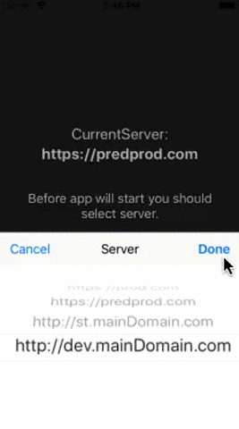

# EnvironmentSwitcher

[](https://developer.apple.com/ios/) [](https://developer.apple.com/ios/) [](https://developer.apple.com/swift/) [](https://cocoapods.org/pods/EnvironmentSwitcher) [](https://raw.githubusercontent.com/AeroAgency/EnvironmentSwitcher/master/LICENSE.md)

ReadMe: [**EN**] | [[RU](README_RU.md)]

**EnvironmentSwitcher** - library for change environments (servers) on the fly.
Intended for testing builds, for developers / testers / managers, who need an opportunity of changing some different servers and http endpoints in one build.

**⚠️️ ATTENTION** Highly recommended using this library only for non-production builds and dont leave it to app store builds.

- [Why?](#why?)
- [Features](#Features)
- [Requirements](#requirements)
- [Installation](#installation)
- [How it work](#how-it-work)
- [Examples](#examples)

## Why?
On apps development sometimes appear situations, when one build should be tested in different environments.
For this case developer should create some builds with same code base, but different http endpoints. This leads to:
- needed create more that one build for testers, what slow down of development process; 
- confusions, which build number and version match to one or another environment.

This library help solve cases:
- one build should be tested on development server and checked, that merge to stage server was succeeded;
- we have different environments with different databases and different data. Build should be tested in all this environments;
- one build should be checked, that release to production was succeeded and:
  - in previous build nothing was broken;
  - current build working correctly after backend release.

## Features
- [x] Listing available servers
- [x] Fitting default server
- [x] Opportunity of servers selection after launch screen, before splash screen will loaded
- [x] Displaying over others `UIWindow` and `UIViewController`
- [x] Portrait and landscape orientations support
- [x] Localization RU
- [x] Localization EN
- [x] Saving last selected environment between app launches
- [ ] Configurability
- [ ] Interactive instruction for testers on first launch
- [ ] Extended examples
- [ ] Documentation

## Requirements
- iOS 10.0+
- Xcode 10.2+
- Swift 5+

## Installation
### CocoaPods
Add the following entry to your Podfile:
```rb
pod 'EnvironmentSwitcher'
```
After run `pod install` command in terminal.
Don't forget to `import EnvironmentSwitcher` in all files, which you planned using this library

### Manual
Download archive of `master` branch (stable version) or interesting version for you from [releases](https://github.com/AeroAgency/EnvironmentSwitcher/releases).
Unzip and drag `Source` folder to your project.

## How it work



1. On init sets a list of available servers and, optionally default server (if didn`t set, default server will first element from available servers list).
2. Library add invisible button  to main `UIWindow` (horizontal center of screen and small indent from status bar by vertical).
Button is visible to dont overlap screen content or title on `NavigationBar`.
3. Double tap on this invisible button, showing button with icon in this area. This button can overlap content.
4. `LongTap` on 2 or more seconds add new `UIWindow` over main and display view controller with list of available servers.

Object, which need get notifications about change environment, should declare method `func serverDidChanged(_ newServer: String)` of `EnvironmentSwitcherDelegate` protocol.

**⚠️️ ATTENTION** By default, EnvironmentSwitcher inits in select server mode, before launch first `UIViewController`. At this moment `keyWindow` in `UIApplication` will replaced.
For correct environment selection before launch first `UIViewController`, you should init EnvironmentSwitcher in `AppDelegate` method:
```swift
func application(_ application: UIApplication, didFinishLaunchingWithOptions launchOptions: [UIApplication.LaunchOptionsKey: Any]?) -> Bool
```
Otherwise you should set `shouldSelectOnStart` as `false` on init. In this case changing server can be initiated only manual and `keyWindow` wasnt replaced.

## Examples
Run with custom `UIWindow` container:
```swift
class MyWindowContainer: MainWindowContaner {
    var mainWindow: UIWindow? {
        return UIWindow()
    }
}

//...

class SomeClass {

    private(set) var switcher: EnvironmentSwitcher
    
    init() {
        let config = ServersListConfigurator(servers: ["https://production.com", "https://stage.com", "https://develop.com"], current: "https://stage.com")
        let application = MyWindowContainer()
        switcher = EnvironmentSwitcher(config, app: application)
        switcher.delegate = self
    }
}

extension SomeClass: EnvironmentSwitcherDelegate {
    func serverDidChanged(_ newServer: String) {
        print("New server is \(newServer)")
    }
}
```
Run with default `UIWindow` container, without preferred server and disabled autostart:
```swift
class SomeClass {

    private(set) var switcher: EnvironmentSwitcher
    
    init() {
        let config = ServersListConfigurator(servers: ["https://production.com", "https://stage.com", "https://develop.com"], shouldSelectOnStart: false)
        switcher = EnvironmentSwitcher(config)
        switcher.delegate = self
    }
}

extension SomeClass: EnvironmentSwitcherDelegate {
    func serverDidChanged(_ newServer: String) {
        print("New server is \(newServer)")
    }
}
```
